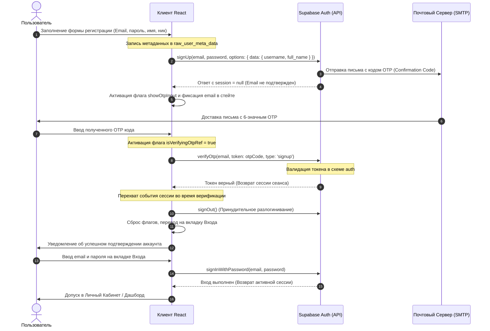

# 🛡️ HackShield Play Nexus — Полное Техническое Руководство & Документация по Развертыванию

**HackShield Play Nexus** — это интерактивная многопользовательская веб-платформа для обучения основам информационной безопасности (Cybersecurity). Платформа сочетает в себе элементы ролевой игры (RPG), интерактивные текстовые сценарии с разветвлённым сюжетом, систему квизов по различным категориям ИБ и полноценный 2D-симулятор проникновения (Stealth Game) с поддержкой кооперативного мультиплеера в реальном времени.

Настоящий документ содержит исчерпывающее техническое описание проекта, используемого стека технологий, архитектуры клиентской и серверной частей, схемы базы данных, механизмов безопасности, детального разбора логических алгоритмов ключевых подсистем и подробной инструкции по хостингу и развертыванию на платформе **Vercel.com**.

---

## 🚀 1. Технологический Стек

Проект построен по современной архитектуре разделения клиента и сервера (BaaS - Backend-as-a-Service) с акцентом на высокую отзывчивость интерфейса, поддержку работы в режиме офлайн и синхронизацию состояния по веб-сокетам в реальном времени.

### 1.1 Frontend (Клиентская часть)
*   **Библиотека рендеринга**: [React 18.3.1](https://react.dev/) — декларативный подход к построению интерфейсов, разделение логики на переиспользуемые хуки и компоненты.
*   **Среда разработки и сборщик**: [Vite 6.0.0](https://vitejs.dev/) — сверхбыстрый сборщик проектов, обеспечивающий моментальную горячую перезагрузку (HMR) модулей через ES-модули.
*   **Язык программирования**: [TypeScript 5.8.3](https://www.typescriptlang.org/) — строго типизированный надмножество JS, минимизирующее ошибки времени выполнения на этапе компиляции.
*   **Стилизация**: [Tailwind CSS 3.4.17](https://tailwindcss.com/) + [Shadcn UI](https://ui.shadcn.com/) (на базе Radix UI примитивов) — кастомная дизайн-система в стиле Glassmorphism (эффект матового стекла, полупрозрачные неоновые границы, размытие фонов) и тёмной киберпанк-эстетики.
*   **Анимации**: [Framer Motion 12.38.0](https://www.framer.com/motion/) — плавные переходы между вкладками, физичные выплывающие панели, анимация появления карточек и состояния тревоги.
*   **Маршрутизация**: [React Router 7.15.0](https://reactrouter.com/) — декларативная организация путей приложения, поддержка вложенных маршрутов и защищённых зон доступа.
*   **Сетевые запросы и кэширование**: [TanStack Query v5 (React Query)](https://tanstack.com/query) — управление серверным состоянием, автоматическое инвалидирование кэша, обработка фоновых обновлений профиля и списков лидеров.
*   **Мультиязычность (i18n)**: `i18next` + `react-i18next` — поддержка 3 языков: русского (`ru`), английского (`en`) и казахского (`kk`). Переводы хранятся в статических JSON-файлах в папке `public/locales/`. Реализовано автоопределение языка пользователя на основе настроек браузера.
*   **Progressive Web App (PWA)**: `vite-plugin-pwa` — интеграция Service Worker на базе Google Workbox. Обеспечивает кэширование статических ресурсов, работу базовых страниц без интернета, оповещения о доступных обновлениях сборки и возможность установки приложения на главный экран мобильного устройства.

### 1.2 Backend & Инфраструктура (BaaS)
*   **Платформа**: [Supabase 2.45.6](https://supabase.com/) — облачная серверная инфраструктура.
    *   **Supabase Auth**: Регистрация и аутентификация пользователей с использованием протокола PKCE (Proof Key for Code Exchange) для обеспечения безопасности обмена сессионными токенами. Подтверждение аккаунтов реализовано через одноразовый 6-значный OTP код (One-Time Password), отправляемый по почте.
    *   **База данных PostgreSQL 15**: Реляционная СУБД с поддержкой сложных транзакций, кастомных хранимых процедур (PL/pgSQL), представлений (Views), триггеров на системные события и безопасности на уровне строк (RLS).
    *   **Supabase Realtime**: Веб-сокет соединение для отслеживания присутствия пользователей на платформе (Presence), обмена мгновенными сообщениями в чатах и синхронизации координат игроков/объектов в кооперативной игре (Broadcast).
    *   **Supabase Storage**: Хранилище бинарных объектов, используемое для загрузки и отдачи пользовательских аватарок (ведро `avatars` с RLS политиками).

---

## 📂 2. Структура Папок и Архитектура Компонентов

Кодовая база структурирована согласно принципу разделения ответственности (Separation of Concerns). Основные исходные коды располагаются в директории `src/`:

```text
src/
├── components/          # Интерактивные компоненты пользовательского интерфейса
│   ├── arena/           # Модули социальной арены (FriendsTab, ChatsTab, UsersList)
│   ├── chat/            # Интерфейс диалогов и обмена сообщениями в реальном времени
│   ├── game/            # Интерфейс 2D-игры: MultiplayerLobby, QuizModal, TaskModal
│   ├── game2d/          # Панели HUD, TouchControls (сенсорное управление для мобильных)
│   ├── ui/              # Низкоуровневые дизайн-компоненты Shadcn UI (кнопки, диалоги, формы)
│   ├── GameScene.tsx    # Ядро 2D-игры на HTML5 Canvas API (отрисовка, управление, цикл)
│   ├── LanguageSwitcher.tsx # Селектор смены языков интерфейса (RU/EN/KK)
│   ├── ProtectedRoute.tsx # Защитный оберточный компонент авторизации для роутера
│   └── PWAUpdatePrompt.tsx  # Модальное окно уведомления о новой PWA-версии
├── contexts/            # Глобальные контексты React
│   └── AuthContext.tsx  # Хранение состояния текущего пользователя и методов сессии
├── hooks/               # Кастомные React-хуки для выноса сложной бизнес-логики
│   ├── map/             # Генерация и загрузка конфигураций игровых комнат
│   ├── profile/         # Хуки для загрузки статистики и ачивок пользователя
│   ├── useAuthSession.ts # Низкоуровневая обработка регистрации, входа и OTP-верификации
│   ├── useGameAI.ts     # Логика перемещения охранников, зрения камер и вычисления FOV
│   ├── useGameCollision.ts # Проверка пересечений физического тела игрока со стенами/дверями
│   ├── useGameProgress.ts # Запись и чтение состояния текущего прохождения комнат в БД
│   ├── useGameState.ts  # Реактивное хранилище состояния 2D-сцены
│   ├── useMultiplayerSync.ts # Broadcaster и Listener для Realtime синхронизации хоста и клиентов
│   └── useScenarioEngine.ts # Машина состояний (FSM) для ветвящихся текстовых сценариев
├── i18n/                # Инициализация i18next и конфигурация локализации
├── lib/                 # Настройки сторонних библиотек
│   └── supabase.ts      # Инициализация синглтона Supabase JS Client
├── pages/               # Страницы приложения (компоненты экранов маршрутизатора)
│   ├── Index.tsx        # Dashboard оператора (статистика, последние миссии, XP)
│   ├── AuthPage.tsx     # Страница авторизации (Вход, Регистрация, ввод OTP-кода)
│   ├── Onboarding.tsx   # Первичная настройка аккаунта при первом входе (выбор никнейма)
│   ├── Missions.tsx     # Список доступных кибер-операций
│   ├── MissionPlay.tsx  # Интерактивное прохождение текстовых миссий
│   ├── Game2D.tsx       # Выбор режима 2D Stealth-игры (Одиночный / Кооперативный)
│   ├── Arena.tsx        # Социальный хаб (Рейтинги, Лента активности, Чат, Друзья)
│   ├── Profile.tsx      # Личный кабинет игрока (Профиль, Статистика, Настройки)
│   └── UserProfile.tsx  # Публичная страница профиля других участников
├── services/            # Слой API запросов к таблицам базы данных Supabase
│   ├── chatService.ts   # Чтение сообщений, создание комнат чата
│   ├── friendsService.ts # Отправка заявок, подтверждение дружбы, блокировка
│   ├── gameProgressService.ts # Синхронизация прогресса 2D-уровней
│   └── scenarioProgressService.ts # Сохранение статуса текстовых миссий
├── types/               # Описания типов TypeScript и интерфейсов сущностей
│   └── game.ts          # Описания типов игровых объектов (Player, Guard, Terminal, Vec2)
└── utils/               # Вспомогательные утилиты общего назначения
    ├── pathfinding.ts   # Алгоритм A* (поиск пути охранников)
    └── visibility.ts    # Геометрические вычисления видимости FOV и Raycasting
```

---

## 📊 3. Архитектура Базы Данных (Supabase PostgreSQL)

Полная схема базы данных спроектирована с учётом нормализации данных, ссылочной целостности и разграничения прав доступа. Полный SQL-скрипт восстановления структуры базы данных находится в файле [rebuild_db.sql](file:///c:/HACKSHIELD/hackshield-play-nexus/supabase/rebuild_db.sql).

### 3.1 Описание Таблиц Базы Данных

Ниже представлены структуры всех таблиц, входящих в состав схемы `public`:

#### 1. Таблица `public.profiles`
Содержит расширенную информацию о профилях пользователей. Связана один-к-одному с системной таблицей авторизации Supabase `auth.users`.

| Имя столбца | Тип данных | Описание |
| :--- | :--- | :--- |
| `id` (PK) | `UUID` | Внешний ключ на `auth.users(id) ON DELETE CASCADE`. |
| `username` | `TEXT` | Уникальный никнейм игрока на платформе (уникальный индекс). |
| `full_name` | `TEXT` | Настоящее или отображаемое полное имя. |
| `role` | `TEXT` | Роль пользователя в системе (например, `user`, `admin`). |
| `avatar_url` | `TEXT` | Ссылка на аватар в хранилище Supabase Storage. |
| `email` | `TEXT` | Адрес электронной почты (для быстрого чтения). |
| `xp` | `INTEGER` | Накопленные очки опыта пользователя (по умолчанию `0`). |
| `level` | `INTEGER` | Текущий уровень игрока (по умолчанию `1`). |
| `telegram` | `TEXT` | Никнейм Telegram. |
| `instagram` | `TEXT` | Никнейм Instagram. |
| `is_online` | `BOOLEAN` | Статус нахождения в сети (по умолчанию `false`). |
| `last_seen_at` | `TIMESTAMPTZ`| Время последней зарегистрированной активности игрока. |
| `bio` | `TEXT` | Краткое описание профиля "О себе". |
| `country` | `TEXT` | Страна пользователя (для фильтрации в лидербордах). |
| `social_links` | `JSONB` | Дополнительные ссылки игрока (по умолчанию `{}`). |
| `show_stats_publicly` | `BOOLEAN` | Флаг видимости профиля в глобальном рейтинге (по умолчанию `true`). |
| `joined_at` | `TIMESTAMPTZ`| Дата регистрации профиля. |

#### 2. Таблица `public.users`
Таблица для обеспечения обратной совместимости с устаревшими модулями платформы.

| Имя столбца | Тип данных | Описание |
| :--- | :--- | :--- |
| `id` (PK) | `UUID` | Ссылка на `auth.users(id) ON DELETE CASCADE`. |
| `email` | `TEXT` | Почтовый адрес пользователя. |
| `xp` | `INTEGER` | Очки опыта (по умолчанию `0`). |
| `created_at` | `TIMESTAMP` | Дата создания записи. |
| `username` | `TEXT` | Уникальный никнейм. |
| `full_name` | `TEXT` | Отображаемое имя. |
| `rank` | `TEXT` | Ранг игрока по опыту (по умолчанию `'Newbie'`). |

#### 3. Таблица `public.friends`
Определяет подтвержденные дружеские связи между пользователями.

| Имя столбца | Тип данных | Описание |
| :--- | :--- | :--- |
| `id` (PK) | `UUID` | Уникальный идентификатор связи (по умолчанию `gen_random_uuid()`). |
| `user_id` | `UUID` | Ссылка на `public.profiles(id) ON DELETE CASCADE`. |
| `friend_id` | `UUID` | Ссылка на `public.profiles(id) ON DELETE CASCADE`. |
| `status` | `TEXT` | Состояние связи (`pending`, `accepted`, `blocked`). |
| `accepted_at` | `TIMESTAMPTZ`| Дата принятия запроса о дружбе. |

*Ограничение*: Уникальный составной индекс `UNIQUE (user_id, friend_id)` предотвращает дублирование связей между одними и теми же пользователями.

#### 4. Таблица `public.friend_requests`
Служит для отслеживания отправленных предложений дружбы.

| Имя столбца | Тип данных | Описание |
| :--- | :--- | :--- |
| `id` (PK) | `UUID` | Уникальный идентификатор заявки. |
| `from_user_id` | `UUID` | Инициатор запроса (ссылка на `profiles(id)`). |
| `to_user_id` | `UUID` | Получатель запроса (ссылка на `profiles(id)`). |
| `status` | `TEXT` | Статус заявки (`pending`, `accepted`, `declined`, `cancelled`). |
| `message` | `TEXT` | Сопроводительное текстовое сообщение к заявке. |
| `created_at` | `TIMESTAMPTZ`| Время создания заявки. |
| `responded_at` | `TIMESTAMPTZ`| Время принятия или отклонения заявки. |

#### 5. Таблица `public.chats`
Комнаты личных сообщений (диалоги).

| Имя столбца | Тип данных | Описание |
| :--- | :--- | :--- |
| `id` (PK) | `UUID` | Уникальный идентификатор чата. |
| `user1_id` | `UUID` | Первый участник (ссылка на `profiles(id)`). |
| `user2_id` | `UUID` | Второй участник (ссылка на `profiles(id)`). |
| `last_message_at` | `TIMESTAMPTZ`| Дата и время отправки последнего сообщения (для сортировки). |

*Ограничение*: Уникальный индекс `UNIQUE (user1_id, user2_id)` предотвращает дублирование комнат для пары игроков.

#### 6. Таблица `public.messages`
Сообщения внутри чатов.

| Имя столбца | Тип данных | Описание |
| :--- | :--- | :--- |
| `id` (PK) | `UUID` | Уникальный идентификатор сообщения. |
| `chat_id` | `UUID` | Ссылка на комнату `public.chats(id) ON DELETE CASCADE`. |
| `sender_id` | `UUID` | Автор сообщения (ссылка на `profiles(id)`). |
| `content` | `TEXT` | Текст сообщения (длина от 1 до 2000 символов). |
| `message_type` | `TEXT` | Тип контента (`text`, `system`, `challenge` — дуэль). |
| `metadata` | `JSONB` | JSON-данные для системных сообщений (например, ID квиза для дуэли). |
| `is_read` | `BOOLEAN` | Флаг прочтения сообщения получателем (по умолчанию `false`). |
| `created_at` | `TIMESTAMPTZ`| Время отправки. |

#### 7. Таблицы `public.achievements` и `public.user_achievements`
Хранение перечня достижений и фактов их открытия игроками.

**`achievements`**:
*   `id` (`UUID`, PK)
*   `title` (`TEXT`) — Название достижения.
*   `description` (`TEXT`) — Описание условий разблокировки.

**`user_achievements`**:
*   `id` (`UUID`, PK)
*   `user_id` (`UUID`, FK к `public.users(id) ON DELETE CASCADE`)
*   `achievement_id` (`UUID`, FK к `public.achievements(id) ON DELETE CASCADE`)
*   `unlocked_at` (`TIMESTAMP`, default `NOW()`)

#### 8. Таблица `public.quiz_categories`
Категории квизов по ИБ.

| Имя столбца | Тип данных | Описание |
| :--- | :--- | :--- |
| `id` (PK) | `TEXT` | Уникальный строковой ключ категории (например, `'network'`). |
| `name_ru` | `TEXT` | Название категории на русском языке. |
| `name_en` | `TEXT` | Название категории на английском языке. |
| `name_kk` | `TEXT` | Название категории на казахском языке. |
| `icon` | `TEXT` | Emoji-иконка категории (например, `'🌐'`). |
| `color` | `TEXT` | Цветовой HEX-код категории для интерфейса. |
| `order_index` | `INTEGER` | Индекс порядка сортировки категорий на экране. |

#### 9. Таблица `public.quizzes`
Информационная база вопросов для квизов и терминалов в 2D-игре.

| Имя столбца | Тип данных | Описание |
| :--- | :--- | :--- |
| `id` (PK) | `TEXT` | Уникальный строковой идентификатор вопроса. |
| `category_id` | `TEXT` | Ссылка на `quiz_categories(id) ON DELETE SET NULL`. |
| `type` | `TEXT` | Формат вопроса (`multiple_choice`, `text_input`, `binary`, `sequence`). |
| `difficulty` | `INTEGER` | Сложность вопроса от 1 до 5. |
| `title_ru` / `_en` / `_kk` | `TEXT` | Заголовок/вопрос на трёх языках. |
| `description_ru` / `_en` / `_kk`| `TEXT` | Подробный текст вопроса на трёх языках. |
| `hint_ru` / `_en` / `_kk` | `TEXT` | Подсказка к вопросу на трёх языках. |
| `correct_answer` | `TEXT` | Правильный текстовый ответ (для `text_input`). |
| `accept_variants` | `TEXT[]` | Массив допустимых вариаций правильного ответа (синонимы). |
| `case_sensitive` | `BOOLEAN` | Флаг чувствительности к регистру букв при проверке ввода. |
| `correct_choice` | `TEXT` | Значение правильного выбора (для `binary` вопросов: `'yes'` / `'no'`). |
| `correct_sequence` | `TEXT[]` | Массив с правильной последовательностью шагов (для `sequence`). |
| `time_limit_seconds` | `INTEGER` | Ограничение времени на ответ (в секундах). |
| `xp_reward` | `INTEGER` | Количество опыта за правильный ответ (по умолчанию `50`). |
| `penalty_on_fail` | `INTEGER` | Штраф опыта при неверном ответе. |
| `is_published` | `BOOLEAN` | Флаг публикации вопроса для игроков (по умолчанию `true`). |

#### 10. Таблица `public.quiz_options`
Варианты ответов для вопросов с множественным выбором (`multiple_choice`).

| Имя столбца | Тип данных | Описание |
| :--- | :--- | :--- |
| `id` (PK) | `UUID` | Уникальный идентификатор варианта. |
| `quiz_id` | `TEXT` | Ссылка на `public.quizzes(id) ON DELETE CASCADE`. |
| `text_ru` / `_en` / `_kk` | `TEXT` | Текст варианта ответа на трёх языках. |
| `is_correct` | `BOOLEAN` | Является ли вариант верным (по умолчанию `false`). |
| `explanation_ru` / `_en` / `_kk`| `TEXT` | Объяснение, почему данный выбор верный или неверный. |
| `order_index` | `INTEGER` | Порядок сортировки вариантов при показе. |

#### 11. Таблица `public.scenario_progress`
Прогресс прохождения игроками текстовых сюжетных миссий.

| Имя столбца | Тип данных | Описание |
| :--- | :--- | :--- |
| `id` (PK) | `UUID` | Уникальный идентификатор прогресса. |
| `user_id` | `UUID` | Ссылка на `auth.users(id) ON DELETE CASCADE`. |
| `mission_id` | `TEXT` | Идентификатор сюжетной миссии. |
| `scenario_id` | `TEXT` | Идентификатор текущего сценария. |
| `current_step_id` | `TEXT` | Текущий шаг (узел диалога) в миссии. |
| `completed_steps` | `TEXT[]` | Массив пройденных шагов в рамках текущего запуска. |
| `history` | `TEXT[]` | История перемещения игрока по узлам. |
| `total_xp` | `INTEGER` | Заработанный в миссии опыт (по умолчанию `0`). |
| `flags` | `JSONB` | Флаги состояния сюжетной линии (выбранные решения игрока). |
| `answers` | `JSONB` | Ответы на встроенные вопросы квизов в сценарии. |
| `status` | `TEXT` | Статус прохождения (`in_progress`, `completed`, `failed`). |
| `started_at` | `TIMESTAMPTZ`| Дата первого запуска. |
| `completed_at` | `TIMESTAMPTZ`| Дата успешного завершения. |

*Ограничение*: Уникальный индекс `UNIQUE (user_id, scenario_id)` гарантирует наличие ровно одной записи прогресса сценария на пользователя.

#### 12. Таблица `public.game_progress`
Состояние прохождения 2D Stealth миссий игроками.

| Имя столбца | Тип данных | Описание |
| :--- | :--- | :--- |
| `id` (PK) | `UUID` | Уникальный идентификатор. |
| `user_id` | `UUID` | Ссылка на `auth.users(id) ON DELETE CASCADE`. |
| `mission_id` | `TEXT` | Идентификатор 2D операции. |
| `current_room_index` | `INTEGER` | Индекс комнаты, в которой находится игрок (по умолчанию `0`). |
| `completed_rooms` | `INTEGER[]` | Список уже взломанных/пройденных комнат. |
| `total_rooms` | `INTEGER` | Общее количество комнат в миссии. |
| `session_xp` | `INTEGER` | Очки опыта за текущую игровую сессию. |
| `health` | `INTEGER` | Текущий уровень здоровья персонажа (от `0` до `100`). |
| `has_key_card` | `BOOLEAN` | Наличие у игрока ключ-карты для открытия дверей. |
| `inventory` | `JSONB` | Список предметов в инвентаре (по умолчанию `[]`). |
| `status` | `TEXT` | Состояние операции (`in_progress`, `completed`, `failed`, `abandoned`). |
| `attempts` | `INTEGER` | Количество попыток прохождения уровня (инкрементируется при перезапуске). |
| `total_play_time_seconds` | `INTEGER` | Общее время нахождения в игровой сессии (в секундах). |
| `started_at` | `TIMESTAMPTZ`| Время начала прохождения. |
| `last_played_at` | `TIMESTAMPTZ`| Время последнего действия. |

---

### 3.2 Представления (Views) базы данных

С целью разгрузки клиентского кода и оптимизации агрегационных вычислений на стороне СУБД, в PostgreSQL созданы следующие представления:

1.  **`leaderboard_live`** — динамический лидерборд. 
    Соединяет таблицу `profiles` с агрегированным числом пройденных квизов, успешно выполненных текстовых сценариев и 2D-миссий. Рассчитывает глобальный порядковый номер игрока в рейтинге на основе опыта с помощью оконной функции:
    ```sql
    RANK() OVER (ORDER BY xp DESC)
    ```
    Фильтрует пользователей, у которых параметр `show_stats_publicly = true`.
2.  **`user_quiz_stats`** — статистика прохождения квизов. 
    Рассчитывает общее количество попыток ответов пользователя, количество правильных решений, процент точности ответов (`accuracy_percent = (correct_answers * 100) / total_answers`) и суммарно полученный опыт.
3.  **`top_room_results`** — лучшие прохождения комнат 2D-игры. 
    Агрегирует данные таблицы лидеров прохождения комнат, отбирая рекорды по минимальному затраченному времени на завершение уровня, с подтягиванием текстовых никнеймов игроков из `profiles`.

---

### 3.3 Хранимые Функции и Триггеры

Проект активно делегирует обработку системных событий триггерным механизмам базы данных PostgreSQL:

*   **`handle_new_user()`** [Срабатывает `AFTER INSERT` на `auth.users`]:
    Автоматически инициализирует профиль игрока в таблицах `public.profiles` и `public.users` сразу после успешного подтверждения почты.
    *   Из метаданных учетной записи `NEW.raw_user_meta_data` извлекаются поля `username` и `full_name`.
    *   Если они не переданы (например, при прямой регистрации через API), функция берет в качестве никнейма левую часть от почтового адреса пользователя (до символа `@`).
*   **`rls_auto_enable()`** [Срабатывает на событие DDL `ddl_command_end`]:
    Системный событийный триггер. При выполнении команд создания таблиц (`CREATE TABLE`) в схеме `public`, триггер автоматически применяет команду `ALTER TABLE ... ENABLE ROW LEVEL SECURITY`. Это предотвращает появление в базе данных таблиц без активных RLS политик.
*   **`increment_xp(xp_to_add)`** [Вызывается через RPC]:
    Безопасная процедура начисления опыта. Выполняется от лица пользователя (`SECURITY DEFINER`), инкрементируя значение `xp` текущей сессии авторизованного игрока (`auth.uid()`) на переданное число.
*   **`accept_friend_request(request_id)`** [Вызывается через RPC]:
    Транзакционная процедура принятия дружбы. 
    *   Проверяет, что заявка имеет статус `pending` и получателем является вызывающий пользователь (`to_user_id = auth.uid()`).
    *   Переводит статус заявки в `accepted`.
    *   В рамках одной транзакции вставляет **две** записи в таблицу `public.friends` (`user_id -> friend_id` и `friend_id -> user_id`), устанавливая взаимную дружбу.
*   **`get_or_create_chat(other_user_id)`** [Вызывается через RPC]:
    Создает комнату приватного чата. Для исключения дублирования комнат (когда один игрок нажал "написать" второму, а второй — первому), функция сортирует идентификаторы пользователей: меньший UUID записывается в `user1_id`, а больший — в `user2_id`. Если комната с такими ID уже существует, функция просто возвращает её UUID.

---

### 3.4 Row Level Security (RLS) Политики безопасности

Row-level security включена для всех таблиц базы данных в принудительном порядке. Основные правила разграничения доступа:

*   **Профили (`profiles`)**: 
    Чтение данных разрешено любым пользователям (`USING (true)`), что необходимо для работы лидерборда и поиска друзей. Запись и обновление разрешены только владельцу профиля, чья сессия совпадает с ID записи (`auth.uid() = id`).
*   **Друзья (`friends` / `friend_requests`)**:
    Просмотр связей разрешен только участникам этих отношений (`auth.uid() = user_id OR auth.uid() = friend_id`). Создавать заявки в друзья может любой авторизованный пользователь, но подтверждать (`UPDATE`) их статус может только получатель заявки (`auth.uid() = to_user_id`).
*   **Диалоги и Сообщения (`chats` / `messages`)**:
    Доступ к сообщениям имеют исключительно участники чата. Запрос на выборку сообщений (`SELECT`) проверяет вхождение пользователя в ассоциированную комнату:
    ```sql
    EXISTS (
      SELECT 1 FROM public.chats c 
      WHERE c.id = messages.chat_id 
        AND (c.user1_id = auth.uid() OR c.user2_id = auth.uid())
    )
    ```
    Отправка сообщения разрешена только от своего имени (`auth.uid() = sender_id`).
*   **Игровой прогресс (`game_progress` / `scenario_progress`)**:
    Записи о прогрессе изолированы. Создание, чтение, изменение и удаление прогресса разрешены только тому пользователю, к чьей учетной записи привязан данный прогресс (`auth.uid() = user_id`).

---

## ⚙️ 4. Логика Ключевых Систем Приложения

### 4.1 Процесс Регистрации и Подтверждения Почты (Auth & OTP Flow)

Система авторизации использует метод регистрации с подтверждением почтового ящика через 6-значный цифровой код (OTP), защищающий платформу от ложных регистраций.



#### Важные технические решения в Auth Flow:
1.  **Предотвращение автоматического входа при верификации**:
    Метод `supabase.auth.verifyOtp` при успешной проверке кода автоматически авторизует клиента и генерирует сессию, что приводит к срабатыванию глобального слушателя `onAuthStateChange`. Чтобы предотвратить преждевременный редирект пользователя на закрытые страницы (пока он не вошел осознанно), в коде [AuthPage.tsx](file:///c:/HACKSHIELD/hackshield-play-nexus/src/pages/AuthPage.tsx) используется флаг-реф `isVerifyingOtpRef = useRef(false)`. При прослушивании событий авторизации, если данный реф равен `true`, событие входа игнорируется.
2.  **Защитный `signOut` после верификации**:
    Сразу после получения успешного ответа от `verifyOtp`, клиент вызывает `supabase.auth.signOut()`, инвалидируя временную сессию верификации. Пользователю предлагается ввести свой пароль заново на вкладке входа. Это гарантирует проверку знания пароля пользователем и корректное прохождение сессионного жизненного цикла.
3.  **Обработка ошибки неподтвержденной почты**:
    Если пользователь пытается войти в систему с верным паролем, но его почта еще не была подтверждена, Supabase возвращает ошибку `Email not confirmed`. Клиент перехватывает этот код ошибки, извлекает введенный email, автоматически переключает форму на режим ввода OTP и отправляет повторный запрос кода на почту.

---

### 4.2 2D-Движок Stealth-игры (Stealth Game Engine)

2D-движок разработан с использованием низкоуровневого рисования на **HTML5 Canvas API** и сосредоточен в компоненте [GameScene.tsx](file:///c:/HACKSHIELD/hackshield-play-nexus/src/components/GameScene.tsx).

*   **Игровой цикл (Game Loop)**:
    Запускается с помощью функции `requestAnimationFrame`. Для обеспечения одинаковой скорости движения персонажей при разной частоте обновления мониторов (60 Гц, 120 Гц, 144 Гц) рассчитывается коэффициент разности времени `deltaTime` (`dt`). Все смещения координат умножаются на `dt`, нормализованный относительно эталонных 60 FPS (16.67 мс).
*   **Сенсорное управление (Touch Controls)**:
    Для мобильных устройств рендерится виртуальный джойстик в левом углу экрана. Смещение пальца рассчитывается относительно центра джойстика, переводя вектор смещения в вектор скорости игрока `velocity`.

#### Математика коллизий (Стена-Игрок):
Персонаж игрока представлен в виде окружности радиуса $R = 12$ пикселей. Стены и закрытые двери представлены в виде прямоугольников (AABB - Axis-Aligned Bounding Box).
Для обеспечения плавного управления реализован алгоритм раздельного скольжения вдоль осей в хуке [useGameCollision.ts](file:///c:/HACKSHIELD/hackshield-play-nexus/src/hooks/useGameCollision.ts):
1.  Вычисляется гипотетическая координата по оси X: `nextX = position.x + velocity.x * dt`.
2.  Строится виртуальный прямоугольник тела игрока в точке `nextX` и старой координате `position.y`.
3.  Если этот прямоугольник пересекается с любым из препятствий (стена/дверь), движение по оси X блокируется (`velocity.x = 0`), а координата X игрока остается прежней.
4.  Вычисляется гипотетическая координата по оси Y с учетом уже скорректированной координаты X: `nextY = position.y + velocity.y * dt`.
5.  Аналогично проверяется коллизия по оси Y. Если есть пересечение, движение по оси Y блокируется.
Этот подход позволяет игроку двигаться по диагонали к стене и "скользить" вдоль нее, а не намертво застревать при малейшем соприкосновении.

#### Расчет зоны видимости FOV (Field of View) в [visibility.ts](file:///c:/HACKSHIELD/hackshield-play-nexus/src/utils/visibility.ts):
Зона видимости камер и охранников представляет собой круговой сектор с вершиной в точке нахождения объекта. Проверка обнаружения игрока проходит в два этапа:
1.  **Проверка секторов (Углы и Дистанция)**:
    Вычисляется евклидово расстояние между игроком и охранником. Если оно превышает радиус обзора `visionRange`, игрок не виден.
    Если расстояние в пределах нормы, вычисляется угол направления на игрока через арктангенс:
    $$\theta_{player} = \text{atan2}(y_{player} - y_{guard}, x_{player} - x_{guard})$$
    Разница углов между направлением взгляда охранника $\theta_{guard}$ и направлением на игрока нормируется в интервал $[-\pi, \pi]$. Игрок попадает в сектор обзора, если модуль разности углов меньше половины угла обзора охранника:
    $$|\theta_{player} - \theta_{guard}| < \frac{\text{FOV}}{2}$$

2.  **Трассировка лучей (Raycasting) против преград**:
    Если геометрически игрок попал в сектор, запускается проверка на наличие стен между ними. Строится отрезок (луч) от центра охранника к центру игрока. Этот отрезок поочередно проверяется на пересечение со всеми прямоугольниками стен на уровне. Если луч пересекает хотя бы одно ребро стены — линия видимости перекрыта, игрок скрыт.

#### Зоны скрытности и вентиляция:
*   **Тени (`shadows`)**: Специальные темные зоны на карте. Если игрок находится внутри прямоугольника тени и при этом не бежит (активирован режим бесшумного шага `isStealthMode`), то дальность обнаружения игрока охранниками снижается до критических $50$ пикселей (ближний контакт).
*   **Вентиляция (`vents`)**: Игрок может прятаться в вентиляционных шахтах. При нахождении в вентиляции флаг `isInVent` переводится в `true`. Охранники полностью игнорируют игроков внутри вентиляции, а их рендеринг на Canvas заменяется полупрозрачным силуэтом.

---

### 4.3 ИИ Охранников (Guard AI) и Поиск Пути A*

Поведение охранников управляется конечным автоматом (FSM) в хуке [useGameAI.ts](file:///c:/HACKSHIELD/hackshield-play-nexus/src/hooks/useGameAI.ts). Доступны следующие состояния:
*   `patrol` (Патрулирование): Охранник циклично обходит массив точек `patrolPoints`.
*   `alert` (Подозрение): Охранник услышал шум или заметил игрока краем глаза. Он выдвигается к точке последнего обнаружения игрока с повышенной скоростью.
*   `chase` (Погоня): Прямой визуальный контакт с игроком. Охранник бежит за игроком со скоростью $2\times$ от базовой. При физическом контакте наносит $30$ единиц урона здоровью игрока.
*   `searching` (Поиск): Игрок скрылся из виду. Охранник стоит на месте последнего обнаружения, хаотично вращает головой (меняет `visionAngle`) в течение 5 секунд, после чего возвращается к патрулированию.

#### Реализация алгоритма A* ([pathfinding.ts](file:///c:/HACKSHIELD/hackshield-play-nexus/src/utils/pathfinding.ts)):
Для обхода сложных препятствий охранниками применяется алгоритм поиска пути по сетке A*.
1.  **Построение сетки**: Карта размером $1200 \times 900$ пикселей разбивается на квадратные ячейки размером $20 \times 20$ пикселей.
2.  **Запекание препятствий**: Каждая ячейка проверяется на пересечение со стенами. Для предотвращения застревания круглого тела охранника при поворотах вокруг углов стен, ячейка помечается как непроходимая (`walkable = false`), если расстояние от ее центра до стены меньше буферного радиуса в $12$ пикселей.
3.  **Поиск пути**:
    *   Используются списки `openList` (кандидаты на рассмотрение) и `closedSet` (уже посещенные узлы).
    *   Для оценки стоимости шага используется функция:
        $$f(n) = g(n) + h(n)$$
        где $g(n)$ — реальная стоимость пути от старта до текущей ячейки, а $h(n)$ — эвристическое расстояние до цели (применяется Манхэттенское расстояние).
    *   Поддерживается движение в 8 направлениях. Стоимость ортогонального шага равна $1.0$, диагонального — $\sqrt{2} \approx 1.414$.
    *   **Защита от срезания углов (Corner-cutting protection)**: При попытке пойти по диагонали, алгоритм проверяет две смежные ортогональные ячейки. Если обе эти ячейки заблокированы стенами, движение по диагонали запрещается, предотвращая визуальное прохождение охранника сквозь угол стены.
4.  **Кэширование путей**: Расчет пути A* — ресурсоемкая операция. Для поддержания стабильных 60 FPS на клиенте, пути кэшируются в `guardPathsRef` с привязкой к ID охранника. Пересчет пути запускается только в трех случаях:
    *   Путь для данного охранника еще не рассчитывался.
    *   Целевая точка сместилась более чем на $15$ пикселей от предыдущей цели.
    *   С момента последнего расчета пути прошло более $500$ миллисекунд (таймаут устаревания кэша).

---

### 4.4 Мультиплеерная Realtime Синхронизация (Co-op Mode)

Кооперативный режим построен по архитектуре **Host-Client** поверх каналов широковещания (Broadcast) и отслеживания присутствия (Presence) в веб-сокетах Supabase. Соответствующий хук — [useMultiplayerSync.ts](file:///c:/HACKSHIELD/hackshield-play-nexus/src/hooks/useMultiplayerSync.ts).

#### Распределение ролей:
*   **Хост (Host)**: Игрок, создавший комнату. Является авторитетным источником состояния игрового мира. Только Хост выполняет расчеты ИИ охранников, траектории движения камер, проверяет взлом терминалов и изменение состояния дверей. Раз в $100$ мс Хост транслирует массив объектов `guards`, `cameras` и `alarmState` всем клиентам в канале.
*   **Клиент (Client)**: Присоединившийся игрок. Получает координаты врагов по сети и выполняет их локальный рендеринг. Отправляет на Хост информацию о своих нажатиях клавиш, использовании гаджетов (например, запуск ЭМИ-гранаты) и своих координатах.

#### Оптимизация сетевого трафика (Троттлинг координат):
Для предотвращения перегрузки веб-сокетов координатами движения игроков, отправка события `player_move` строго лимитирована частотой **20 Гц** (один пакет в 50 мс):
*   При перемещении персонажа запоминается время последней отправки пакета.
*   Если с момента последней отправки прошло менее 50 мс, отправка откладывается.
*   Создается таймер (сброс по `clearTimeout`), который выполнит отправку координат по истечении оставшегося времени (метод trailing edge). Это гарантирует, что финальная точка, в которой остановился игрок, обязательно будет доставлена остальным участникам, несмотря на троттлинг в процессе движения.

#### Алгоритм Миграции Хоста (Host Migration):
В случае непредвиденного отключения Хоста от сети (закрытие вкладки браузера, обрыв связи) игра не прерывается благодаря детерминированному перевыбору Хоста:
1.  Каждый клиент отслеживает список участников через `PresenceState`.
2.  При получении события `presence('sync')` клиент анализирует, остался ли в списке участников игрок с флагом `is_host: true`.
3.  Если Хост пропал из списка присутствия, все оставшиеся клиенты сортируют массив UUID участников по алфавиту.
4.  Игрок, чей UUID оказался первым в отсортированном списке, автоматически повышает свой статус: переводит локальный флаг `isHost` в `true` и отправляет в канал обновленный пакет `presence.track` с флагом `is_host: true`.
5.  Новый Хост бесшовно берет на себя вычисление ИИ охранников и логику комнат с сохранением текущего прогресса прохождения.

---

### 4.5 Сценарии и Квизы

*   **Машина состояний сценариев ([useScenarioEngine.ts](file:///c:/HACKSHIELD/hackshield-play-nexus/src/hooks/useScenarioEngine.ts))**:
    Текстовые миссии представляют собой направленный ориентированный граф (DAG), где каждый узел — это экран диалога с определенным списком вариантов ответов. Переходы по ребрам графа зависят от выборов пользователя и флагов состояния `flags`, которые записываются в базу данных.
*   **Логика начисления XP**:
    Очки опыта за квизы зависят от скорости ответа. Базовая награда за вопрос составляет `xp_reward` (из БД). Если игрок дает правильный ответ быстрее, чем за $10$ секунд, к награде прибавляется временной бонус:
    $$\text{Bonus} = \max\left(10, \text{Round}\left( \frac{\text{Limit} - \text{TimeSpent}}{\text{Limit}} \times 20 \right)\right)$$
    В случае ошибки из общего XP сессии вычитается штраф `penalty_on_fail`.

---

## ⚡ 5. Развертывание на Vercel (Vercel Deployment Guide)

Для размещения клиентской части проекта **HackShield Play Nexus** на платформе [Vercel](https://vercel.com/) необходимо выполнить следующие настройки.

### 5.1 Файл `vercel.json` (Управление маршрутизацией)
Поскольку приложение является Single Page Application (SPA) с использованием `React Router`, все переходы между страницами осуществляются локально на клиенте. При обновлении страницы или прямом переходе по ссылке (например, `/profile`) Vercel по умолчанию попытается найти соответствующий статический файл (например, `profile.html`) и вернет ошибку 404.

Для перенаправления всех запросов на корневую страницу `index.html` в корне проекта уже настроен файл [vercel.json](file:///c:/HACKSHIELD/hackshield-play-nexus/vercel.json):
```json
{
  "rewrites": [
    {
      "source": "/(.*)",
      "destination": "/index.html"
    }
  ]
}
```

### 5.2 Пошаговый процесс деплоя на Vercel
1.  **Создание проекта на Vercel**:
    *   Перейдите в личный кабинет [vercel.com](https://vercel.com/) и нажмите кнопку **Add New** -> **Project**.
    *   Подключите свой аккаунт GitHub/GitLab и выберите репозиторий с проектом `hackshield-play-nexus`.
2.  **Настройка конфигурации сборки**:
    Vercel автоматически распознает проект на базе **Vite**. Убедитесь, что параметры сборки выглядят следующим образом:
    *   **Framework Preset**: `Vite`
    *   **Root Directory**: `./`
    *   **Build Command**: `npm run build`
    *   **Output Directory**: `dist`
    *   **Install Command**: `npm install` (или `bun install` если вы используете Bun)
3.  **Добавление Переменных Окружения (Environment Variables)**:
    Разверните вкладку **Environment Variables** в настройках проекта Vercel и добавьте следующие переменные:

    | Ключ (Key) | Значение (Value) | Описание |
    | :--- | :--- | :--- |
    | `VITE_SUPABASE_URL` | `https://your-project.supabase.co` | API URL вашего инстанса Supabase. |
    | `VITE_SUPABASE_ANON_KEY` | `eyJhbGciOiJIUzI1NiIsInR5cCI6IkpXVCJ9...` | Публичный анонимный API ключ Supabase. |
    | `VITE_USE_SUPABASE` | `true` | Флаг включения интеграции с Supabase. |
    | `VITE_ENABLE_ANALYTICS` | `false` | Флаг включения систем аналитики (по желанию). |

4.  **Деплой**: Нажмите кнопку **Deploy**. Сборка займет около 1–2 минут. После этого проект будет доступен по бесплатному домену вида `https://hackshield-play-nexus.vercel.app`.

---

## 🔑 6. Настройки на стороне Supabase для Production

Чтобы авторизация, OTP-коды и веб-сокеты корректно работали в боевой среде на домене Vercel, необходимо внести изменения в панели управления [Supabase Dashboard](https://supabase.com/dashboard/):

### 6.1 Настройка URL Авторизации (Redirect URLs)
Supabase Auth должен знать, на какие домены разрешено перенаправлять пользователей после прохождения авторизации (в том числе верификации почты/пароля):
1.  Перейдите в раздел **Authentication** -> **URL Configuration**.
2.  Установите **Site URL** в значение вашего основного домена Vercel (например, `https://hackshield-play-nexus.vercel.app`).
3.  В секции **Redirect URLs** добавьте следующие адреса обратного вызова:
    *   `https://hackshield-play-nexus.vercel.app`
    *   `https://hackshield-play-nexus.vercel.app/auth`
    *   Если вы тестируете проект локально, оставьте в Redirect URLs адрес `http://localhost:8080`.

### 6.2 Подключение внешнего SMTP для OTP-писем (КРИТИЧЕСКИ ВАЖНО)
> [!WARNING]
> Стандартный почтовый провайдер Supabase (встроенный SMTP-сервер) имеет строгий лимит на отправку писем: **не более 3 писем в час**. Поскольку в проекте HackShield Play Nexus регистрация завязана на обязательный ввод 6-значного OTP-кода, при превышении лимита новые игроки перестанут получать коды и не смогут создать аккаунты.

Для стабильной работы в Production настройте кастомный SMTP-сервер (например, через бесплатный тариф **Resend**, **SendGrid**, **Mailgun** или **SMTP** от Яндекса/Google):
1.  Перейдите в **Authentication** -> **Providers** -> **SMTP**.
2.  Переведите переключатель **Enable Custom SMTP** в положение `ON`.
3.  Заполните параметры подключения:
    *   **Sender email**: адрес вашей почты (например, `noreply@yourdomain.com`).
    *   **Sender name**: `HackShield Play Nexus`.
    *   **SMTP Host**: хост вашего провайдера (например, `smtp.resend.com`).
    *   **SMTP Port**: обычно `465` (SSL) или `587` (TLS).
    *   **SMTP Username**: логин/API ключ.
    *   **SMTP Password**: пароль или токен доступа.
4.  Сохраните изменения. Теперь лимиты отправки писем будут определяться вашим почтовым провайдером.

### 6.3 Настройка политик CORS для баз данных и Realtime
Если ваши клиенты подключаются к базе данных и используют веб-сокеты в реальном времени, убедитесь, что домен Vercel разрешен в настройках API (раздел **Project Settings** -> **API** -> **CORS API Allowed Origins**). По умолчанию в Supabase установлено значение `*` (разрешены любые домены), что вполне подходит для веб-приложений.

---

## 🛠️ 7. Команды Локальной Разработки и Сборки

Все ключевые скрипты управления проектом задекларированы в файле `package.json`:

*   `npm run dev` — запуск локального сервера разработки Vite с поддержкой горячей замены модулей (HMR). По умолчанию запускается на порту `8080`.
*   `npm run build` — компиляция проекта для Production среды. Включает в себя:
    *   Проверку типов TypeScript.
    *   Минификацию и оптимизацию JS/CSS кода (Vite + Esbuild).
    *   Генерацию PWA ассетов и Service Worker.
    *   Вывод готовых файлов в директорию `dist/`.
*   `npm run typecheck` — ручной запуск TypeScript-компилятора в режиме проверки кода без вывода файлов (`tsc --noEmit`).
*   `npm run test` — однокра запуск всех модульных тестов в проекте с использованием тестового фреймворка `Vitest`.
*   `npm run test:watch` — запуск тестов в режиме отслеживания изменений файлов для непрерывной интеграции (TDD).
